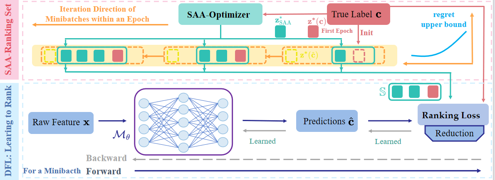
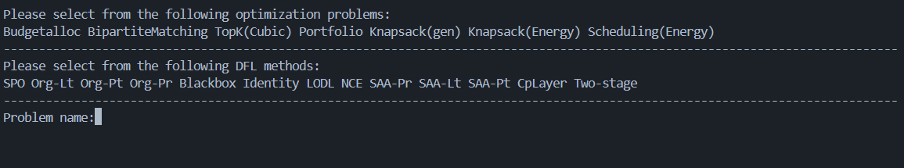
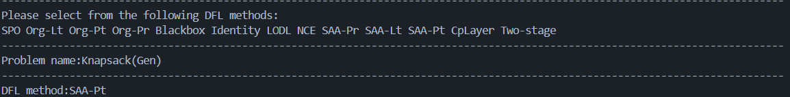
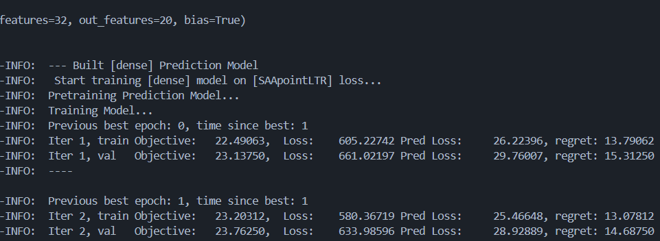
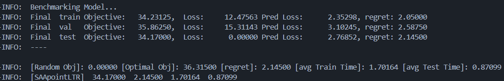

<h1 align="center"><b> Decision-Focused Learning:  Learning to Rank Based on Sample Average Approximation </b></h1>

The following is the abstract of our paper, along with instructions for the framework and experimental procedures.

## Abstract

Decision-Focused Learning (DFL) improves prediction models by directly optimizing the decision quality of downstream optimization problems, where Learning to Rank (LTR) approaches treat the solution set as a ranking set and design surrogate losses based on the objective function.The DFL-LTR framework exhibits strong applicability; however, it lacks a specially designed subset construction method, which limits its performance.To address this issue, tailored to the intrinsic characteristics of the DFL-LTR framework, we first articulate two fundamental bottlenecks that any ranking subset construction must resolve: ($\textit{i}$) the infeasibility of fully enumerating the solution space; ($\textit{ii}$) the resulting upper bound on the loss function family that remains unbroken. To eliminate these limitations, we introduce a ranking subset construction paradigm driven by Sample Average Approximation (SAA). By performing stochastic optimization over minibatches, the proposed method yields an equivalent approximation of the complete solution set, suppresses loss variance to stabilise gradients, and consequently elevates the performance upper bound of the entire framework.
Our LTR-SAA subset construction module is fully plug-and-play: it introduces no extra hyperparameters, incurs zero additional time complexity, and remains compatible with the entire family of LTR loss functions.In the latest open-source benchmark (comprising 7 optimization problems), our proposed method achieves SOTA decision quality on 5 of these problems. Compared with other DFL and two-stage methods, it demonstrates significant performance advantages and generality.

##  DFL:LTR-SAA    Framework  




   

### Install    
Prior to running this benchmark, you could install this package locally using:    
```
pip install -e .
```
### Dataset
For the dataset, we recommend using the curated "data.zip" from previous benchmark experiments. The access method is described in both the original paper and the appendix of this study. Simply place the zip file into the empty folder ```code for paper\rethink_exp\openpto\data``` to start the experiment.


### Run of Experiment

Our experimental file is:  ```code for paper/rethink_exp/test programing.py```. After running it with a compatible Python kernel, the terminal will prompt the experimenter to select the problem and DFL method for the experiment. This selection is implemented using Python's input command. Note that you must copy the content from the printed options without any extra characters; otherwise, the program will throw an error. A specific example is as follows:


Subsequently, the training process will be executed automatically, with the training procedure visualized as follows:


After training is completed, the system will output the final test results, which will be recorded in log.txt. The following is an example using our SOTA method on the Knapsack (Gen) problem:

During the review stage, we only make some problems and methods publicly available. Your understanding is appreciated. However, it should be noted that all our SOTA methods are available for experimentation, and users can conduct experiments independently to compare results with those in the original benchmark paper.
